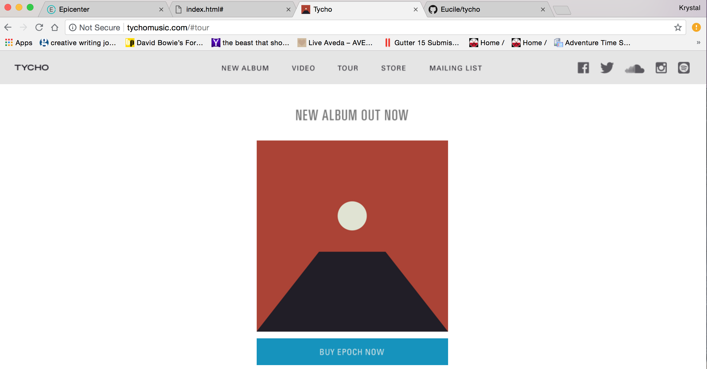
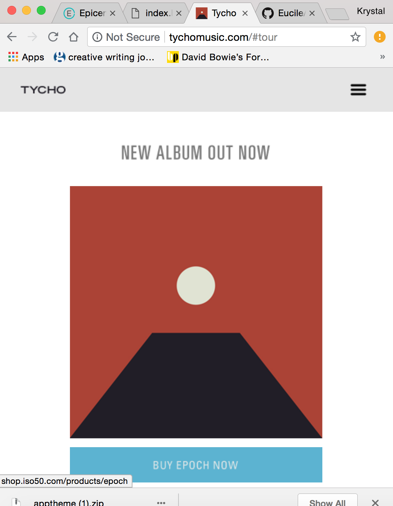
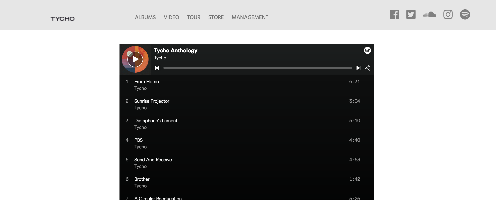
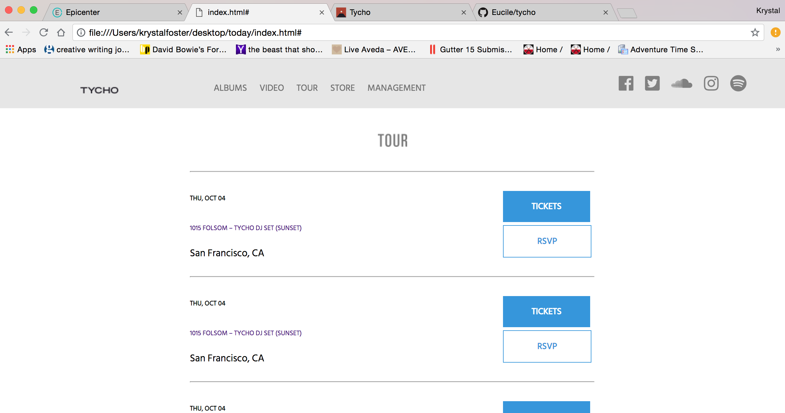
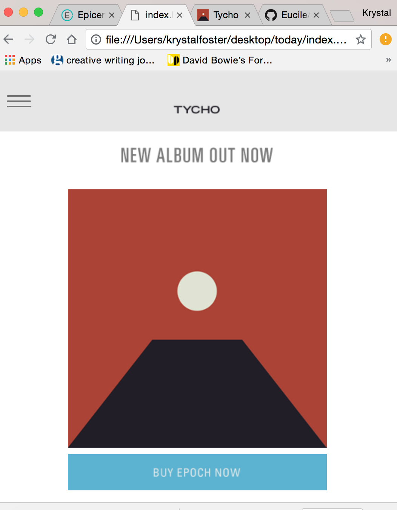

# Tycho

##### A Mock-Up of Tycho's website, Sep. 7th, 2018

#### By Krystal Foster

## Description

This project imitates the general layout and responsive design of the band's website, using a combination of flexbox, scss, spotify iframes, and a clickable line menu manipulated with pseudo elements to collapse and display block elements. No javaScript required.

## Screenshots of Original site:

## Screenshots of my working mock-up:

## Setup

Clone this repository or open in gh-pages. It can be found at [GitHub Pages](https://eucile.github.io/tycho/)

## Technologies Used

* HTML
* CSS
* fontawesome
* SASS
* Flexbox
* Spotify api

## Support and contact details

Please reach me at kmfoster777@gmail.com for questions or comments.

### Legal

Copyright (c) 2018 Krystal Foster

This software is licensed under the MIT license.
